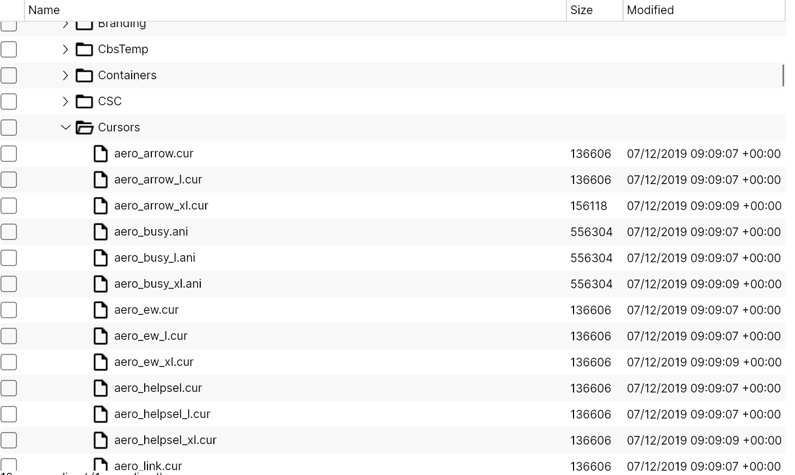
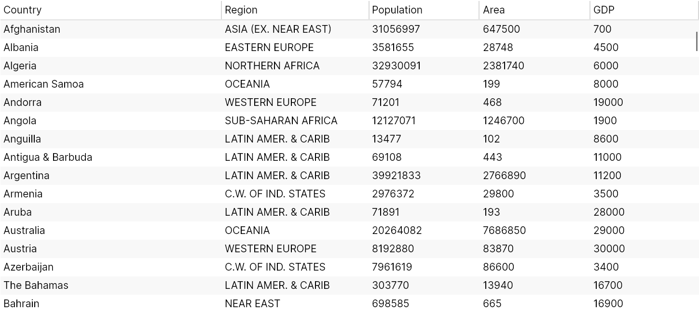

# TreeDataGrid

## 介绍

`TreeDataGrid` 是 [Avalonia](https://github.com/AvaloniaUI/Avalonia) UI 框架中的一个控件，它可以在单个视图中同时显示分层和表格数据。它是 `TreeView` 和 `DataGrid` 控件的组合。

该控件有两种工作模式：

* 分层：数据以树状结构显示，可以有可选的列
* 平铺：数据以二维表格形式显示，类似于其他 `DataGrid` 控件

`TreeDataGrid` 显示分层数据的示例：

<figure><figcaption></figcaption></figure>

`TreeDataGrid` 显示平铺数据的示例：


<figure><figcaption></figcaption></figure>

### 当前状态

该控件目前处于**早期测试版**阶段。因此可能会有一些 bug，缺少一些功能和文档，但控件应该是基本可用且性能良好的。

**注意**：

我们接受问题和拉取请求，但我们只回复和审核由我们的客户创建的拉取请求和问题。这是一个相当大的项目，处理所有问题和拉取请求将需要比我们有的更多的时间。但是请随时打开问题和拉取请求，因为它们对我们可能会有用！

### 安装

* 在项目中添加 `Avalonia.Controls.TreeDataGrid` NuGet 包
* 在 `App.xaml` 文件中添加 `TreeDataGrid` 主题（使用以下标记中的 `StyleInclude`）：

```markup
<Application xmlns="https://github.com/avaloniaui"
             xmlns:x="http://schemas.microsoft.com/winfx/2006/xaml"
             x:Class="AvaloniaApplication.App">
  <Application.Styles>
    <FluentTheme/>
    <StyleInclude Source="avares://Avalonia.Controls.TreeDataGrid/Themes/Fluent.axaml"/>
  </Application.Styles>
</Application>
```

### 源代码仓库

[**Avalonia.Controls.TreeDataGrid**](https://github.com/AvaloniaUI/Avalonia.Controls.TreeDataGrid)
