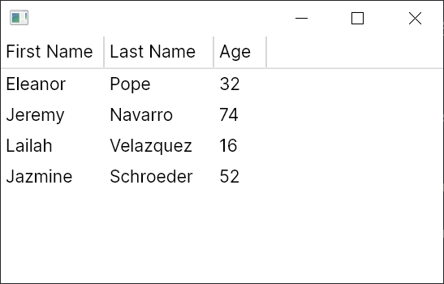

# 创建平铺的 TreeDataGrid

一个 `TreeDataGrid` 有两个部分：

* "源" 是在代码中定义的，描述数据模型如何映射到 `TreeDataGrid` 的行和列。
* 控件可以从 XAML 或代码中实例化，描述 `TreeDataGrid` 的外观。

如果您使用 MVVM 模式，源通常在视图模型层中定义，但也可以在代码后台中定义。本介绍将假设您使用 MVVM 模式。

本文假设您正在使用 C# 10，并已启用[可空引用类型](https://docs.microsoft.com/zh-cn/dotnet/csharp/nullable-references)。

### 安装

首先按照安装说明进行安装，确保将主题添加到您的 `App.axaml` 文件中。

### 数据模型

数据模型是要显示在 `TreeDataGrid` 中的源数据，它将特定于您的应用程序。在本介绍中，我们将使用一个非常简单的 `Person` 类：

```csharp
public class Person
{
    public string? FirstName { get; set; }
    public string? LastName { get; set; }
    public int Age { get; set; }
}
```

首先创建一个包含我们简单数据集的 `MainWindowViewModel`：

```csharp
using System.Collections.ObjectModel;
using Avalonia.Controls;
using Avalonia.Controls.Models.TreeDataGrid;

public class MainWindowViewModel
{
    private ObservableCollection<Person> _people = new()
    {
        new Person { FirstName = "Eleanor", LastName = "Pope", Age = 32 },
        new Person { FirstName = "Jeremy", LastName = "Navarro", Age = 74 },
        new Person { FirstName = "Lailah ", LastName = "Velazquez", Age = 16 },
        new Person { FirstName = "Jazmine", LastName = "Schroeder", Age = 52 },
    };
}
```

我们将数据存储在一个 [`ObservableCollection<T>`](https://docs.microsoft.com/zh-cn/dotnet/api/system.collections.objectmodel.observablecollection-1?view=net-6.0) 中，这将允许 `TreeDataGrid` 监听数据的变化，并自动更新 UI。

### `TreeDataGrid` 源

源定义了如何将数据模型映射到行和列。因为我们要显示非分层数据，所以我们将使用 `FlatTreeDataGridSource<Person>`。`FlatTreeDataGridSource` 是一个泛型类，其中类型参数表示数据模型类型，即 `Person`。

`FlatTreeDataGridSource` 的构造函数接受一个类型为 `IEnumerable<T>` 的集合，我们将数据集传递给它。

我们将在 `MainWindowViewModel` 构造函数中创建源，添加三列，并在一个属性中公开源：

```csharp
public class MainWindowViewModel
{
    private ObservableCollection<Person> _people = /* 在前面定义 */

    public MainWindowViewModel()
    {
        Source = new FlatTreeDataGridSource<Person>(_people)
        {
            Columns =
            {
                new TextColumn<Person, string>("First Name", x => x.FirstName),
                new TextColumn<Person, string>("Last Name", x => x.LastName),
                new TextColumn<Person, int>("Age", x => x.Age),
            },
        };
    }

    public FlatTreeDataGridSource<Person> Source { get; }
}
```

上面的列被定义为 `TextColumn` - 同样，`TextColumn` 是一个泛型类，它接受数据模型类型和值类型。`TextColumn` 的第一个参数是列中要显示的标题，第二个参数是一个 lambda 表达式，它从数据模型中选择要显示的值。

### `TreeDataGrid` 控件

现在是时候将 `TreeDataGrid` 控件添加到窗口并将其绑定到源了。

```markup
<Window xmlns="https://github.com/avaloniaui"
        xmlns:x="http://schemas.microsoft.com/winfx/2006/xaml"
        x:Class="AvaloniaApplication.MainWindow">
  <TreeDataGrid Source="{Binding Source}"/>
</Window>
```

### 运行应用程序

运行应用程序，您应该看到数据显示出来：

<figure><figcaption></figcaption></figure>
