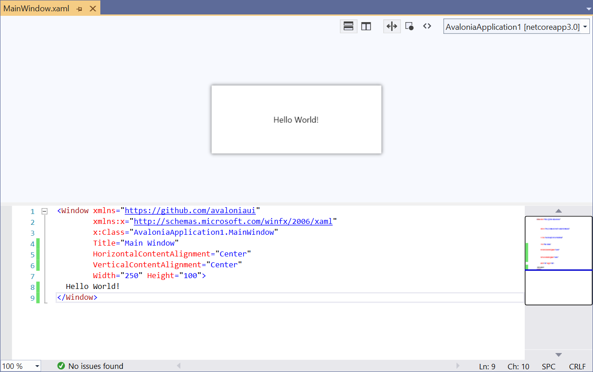

# 基础开发环境（IDE）支持

### JetBrains Rider

从 2020.3 开始， JetBrains [Rider](https://www.jetbrains.com/rider/) IDE 内置了对 Avalonia XAML 的支持，包括对 Avalonia 特定的 XAML 功能和自定义代码检查的一流支持。

有关详细信息，请参阅[JetBrains Rider 2020.3 发布公告。](https://www.jetbrains.com/rider/whatsnew/2020-3/#version-2020-3-avalonia-support)

Rider 尚未提供视觉设计器，但正在开发中。有关如何安装的更多信息和说明，请参阅[Github项目](https://github.com/ForNeVeR/AvaloniaRider)。

### Visual Studio

#### Avalonia Visual Studio 扩展

[Avalonia for Visual Studio 扩展](https://marketplace.visualstudio.com/items?itemName=AvaloniaTeam.AvaloniaVS)包含一个 XAML 设计器，可用于在您编写 XAML 时显示实时预览。安装 Avalonia for Visual Studio 扩展后，双击 Avalonia XAML 文件将其打开。

<figure><figcaption></figcaption></figure>

如果您使用的是 VS2019 或 VS2017，则需要安装[旧版本的扩展](https://marketplace.visualstudio.com/items?itemName=AvaloniaTeam.AvaloniaforVisualStudio)。

#### 适用于 Visual Studio 的 ReSharper

对于 Visual Studio 和 ReSharper 用户，[ReSharper 2020.3 引入了](https://www.jetbrains.com/resharper/whatsnew/2020-3/#version-2020-3-avalonia-support)内置代码分析、代码完成、导航和查找用法。

如果您的 XAML 在库中，Avalonia 需要一个可执行应用程序才能预览它。从设计器右上角的下拉列表中选择一个可执行项目。构建项目后，在编辑器中编辑 XAML 将导致预览自动更新。

在某些情况下，由于 Visual Studio 中的错误/限制，不会显示 Avalonia XAML 设计器，而是显示 WPF 设计器。如果您的 XAML 文件显示大量错误，请尝试右键单击该文件，然后选择“打开方式...”→“Avalonia XAML 编辑器”。

### 设计时属性

有许多属性可以应用于您的控件，这些属性仅在设计时生效。要使用它们，您必须将命名空间添加到您的 XAML 文件：

```xml
xmlns:d="http://schemas.microsoft.com/expression/blend/2008"
```

添加命名空间后，以下设计时属性将可用：

#### d:DesignWidth 和 d:DesignHeight

和属性将宽度`d:DesignWidth`和`d:DesignHeight`高度应用于正在预览的控件。

```xml
<Window xmlns="https://github.com/avaloniaui"
        xmlns:x="http://schemas.microsoft.com/winfx/2006/xaml"
        xmlns:d="http://schemas.microsoft.com/expression/blend/2008"
        d:DesignWidth="800" d:DesignHeight="450"
        x:Class="AvaloniaApplication1.MainWindow">
    Welcome to Avalonia!
</Window>
```

#### d:DataContext

该`d:DataContext`属性`DataContext`仅在设计时应用。建议您将此属性与`{x:Static}`指令结合使用，以引用其中一个程序集中的静态属性：

```xml-doc
<Window xmlns="https://github.com/avaloniaui"
        xmlns:x="http://schemas.microsoft.com/winfx/2006/xaml"
        xmlns:d="http://schemas.microsoft.com/expression/blend/2008"
        xmlns:dd="clr-namespace:My.Namespace;assembl=MyAssembly"
        d:DataContext="{x:Static dd:DesignData.ExampleViewModel}"
        x:Class="AvaloniaApplication1.MainWindow">
    Welcome to Avalonia!
</Window>
```

```csharp
namespace My.Namespace
{
    public static class DesignData
    {
        public static MyViewModel ExampleViewModel { get; } = new MyViewModel
        {
            // View Model initialization here.
        };
    }
}
```

#### Design.DataContext

或者，您可以使用`Design.DataContext`附加属性。以及 Design.Width 和 Design.Height。

```xml
<Window xmlns="https://github.com/avaloniaui"
        xmlns:x="http://schemas.microsoft.com/winfx/2006/xaml"
        xmlns:d="http://schemas.microsoft.com/expression/blend/2008"
        xmlns:dd="clr-namespace:My.Namespace;assembly=MyAssembly"
        x:Class="AvaloniaApplication1.MainWindow"
        Design.Width="100">
    <Design.DataContext>
        <dd:MyViewModel />
    </Design.DataContext>
    Welcome to Avalonia!
</Window>
```


### 诊断错误

如果遇到问题，请尝试启用详细日志记录。去做这个：

* 在 Visual Studio 中选择“工具”→“选项”菜单
* 从列表中选择“Avalonia XAML 编辑器”
* 在“最低日志详细程度”下选择“详细”

日志将显示在 Visual Studio 输出窗口中。选择“显示输出自：Avalonia Diagnostics”。

### 故障排除和常见问题解答

**Visual Studio 不显示 Avalonia 预览器**

有时 Visual Studio`XAML`使用 WPF 而不是 Avalonia 的编辑器打开 -file。通常，如果您关闭错误显示的文档并再次打开它，这个问题就会得到解决。

如果这没有帮助，您也可以右键单击该文件并选择`[Open With ...]`. 在打开的对话框中选择`[Avalonia XAML Editor]`。

**我的预览是空的**

如果您的预览未正确显示，请尝试（重新）构建项目或解决方案。预览器需要有效的构建才能正常工作。

此外，如果您的解决方案中有多个项目，您可能需要选择应该用于渲染预览的项目。这可以通过下面显示的下拉菜单来完成。

!\[]\(../../../.gitbook/assets/VisualStudioPreviewer\_SelectProjectForPreview.png)

<figure><figcaption><p>显示如何选择用于渲染预览的项目</p></figcaption></figure>

